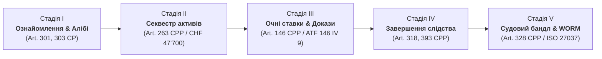

# 🏛️ РЕОРГАНІЗАЦІЯ B-SDD LEGAL COCKPIT: ВІД ІНСТРУМЕНТАЛЬНОГО ДО ПРОЦЕДУРНОГО ПІДХОДУ (CPP RS 312.0)
**Архітектурне рішення, специфікація Astryx UI та покрокові промпти для Google AI Studio**

---

## 1. АРХІТЕКТУРНИЙ АНАЛІЗ: ЧОМУ ПРОЦЕДУРНИЙ ПІДХІД ПОВИНЕН ЗАМІНИТИ ІНСТРУМЕНТАЛЬНИЙ

### 1.1. Критика інструментально-центричного підходу (Current State)
Зараз інтерфейс B-SDD Cockpit організований як «майстерня інженера»: у верхньому меню винесено понад 10 різнорідних кнопок та вкладок (*Factbook, Фігуранти, Клопотання, Студія Diff, WORM, Кодекси, Судовий бандл, Майстер доказів, Майстер фігурантів, Синхронізація справи, GDrive селектор тощо*).
* **Когнітивне перевантаження адвоката:** Користувач повинен самостійно тримати в голові процедурну карту справи: на якому етапі перебуває провадження `PE24.014624-SBA`, які клопотання є невідкладними, які строки спливають (наприклад, 10 днів на оскарження за ст. 396 КПК) і які саме інструменти потрібні саме зараз.
* **Фрагментація доказової бази:** Докази (Factbook) відірвані від клопотань (Pleadings), а клопотання відірвані від стадій слідства.
* **Візуальний шум:** Нагромадження кнопок різного кольору та стилю на єдиній панелі 44px («nested border syndrome»).

### 1.2. Переваги процедурно-центричного підходу (Procedure-First Pipeline)
Швейцарський кримінально-процесуальний кодекс (**CPP RS 312.0**) та норми ЦК/ЗК (**CC/CO**) мають **природну стадійну структуру скінченного автомата (State Machine)**. Адвокат мислить не поняттям «який інструмент відкрити», а поняттям «яку процесуальну дію необхідно вчинити в інтересах довірителя»:



#### Матриця співвідношення «Процедурна стадія ↔ Необхідний контекстний інструментарій»:
1. **Стадія I: Початок провадження & Спростування наклепу (Art. 301, 303, 304 CP, Art. 115, 178 CPP)**
   * *Мета:* Закріплення статусу потерпілого Арсена Коваленка (L-04), імунітету Адріано Міллі (L-03, ст. 933 CC), захисту Олени Коваленко (PADR, ст. 18/48 CP), спростування вигаданого побиття в Рене.
   * *Контекстні інструменти:* Порівняння таймлінії алібі EXIF 1481 з викликом поліції 117, медичний висновок Unisanté FOR597, верифікатор шкоди майну (окуляри P-16, ст. 144 CP).
2. **Стадія II: Забезпечувальні заходи & Терміновий секвестр рахунків (Art. 263 CPP, Art. 122 CPP, Art. 41/49 CO)**
   * *Мета:* Невідкладне блокування банківських рахунків підозрюваних (UBS, Wise) на суму **CHF 47'700.00**.
   * *Контекстні інструменти:* Калькулятор розрахунку суми арешту ($15k USD + замок CHF 850 + окуляри скрипаля CHF 850 + моральна шкода CHF 32'500), драфтер клопотання про арешт рахунків, банківський трекер Wise (P-05).
3. **Стадія III: Збирання доказів & Очні ставки (Art. 139, 146 CPP, ATF 146 IV 9, ATF 147 IV 9)**
   * *Мета:* Проведення допитів та очних ставок з дослідженням аудіозаписів погроз вбивством і вимагання.
   * *Контекстні інструменти:* Фоноскопічний плеєр із таймкодами та синхронними цитатами, тест балансу інтересів ATF 146 IV 9, картки тактики допиту.
4. **Стадія IV: Завершення попереднього слідства & Оскарження (Art. 318, 393, 396 CPP)**
   * *Мета:* Подання додаткових доказів перед закриттям провадження (ст. 318) та оскарження постанов прокурора у 10-денний присічний строк (ст. 393/396).
   * *Контекстні інструменти:* Таймер зворотного відліку 10 днів (Art. 396 al. 1 CPP), генератор скарги до Chambre des recours pénale, граф переходів процесу.
5. **Стадія V: Судове слухання, Офіційний бандл & Scellement WORM (Art. 100, 328 CPP, ISO/IEC 27037)**
   * *Мета:* Фіксація справи в незмінному реєстрі Utopia DB, друк судового бандлу PDF/A, бездротове відправлення на Amazon Kindle (`tu***@kindle.com`).
   * *Контекстні інструменти:* WORM Ledger Inspector, генератор судового бандлу, експортер EPUB 3.0 Whispersync.

---

## 2. НОВА АРХІТЕКТУРА ІНТЕРФЕЙСУ (ASTRYX SIMPLIFIED UI)

### 2.1. Концепція спрощення Topbar (Згортання з 14 елементів до 3 зон)
Замість перевантаженого меню верхній рядок Topbar трансформується у лаконічний контролер:

```
[ PE24.014624-SBA ▼ ]   |   [ ⚖️ Процедури (5) ]  [ 🧰 Інструменти ]  [ 🤖 ШІ-Студія ]   |   [ ⚡ Дії ▼ ]  [ UA ▼ ]  [ ⚙️ ]
```

1. **Ліва зона (Active Case):** Бейдж справи `PE24.014624-SBA` з випадаючим списком досьє та суду.
2. **Центральна зона (2 перемикачі):**
   * **`⚖️ Процедури`** — покроковий пайплайн справи (активний за замовчуванням).
   * **`🧰 Інструменти`** — окрема повнофункціональна вкладка каталогу всіх існуючих інструментів.
   * **`🤖 ШІ-Студія`** — Astryx Copilot & Legal Prompt Studio.
3. **Права зона (Згорнуті інструменти Astryx):**
   * **`⚡ Швидкі дії` (Astryx Action Drawer / Command Palette):** єдина компактна кнопка, що відкриває вспливаюче меню або модальну шторку з усіма майстрами:
     - ➕ Додати доказ (локальний файл / Google Drive)
     - ➕ Додати фігуранта справи
     - 📜 Кодекси Швейцарії (CH/VD)
     - 🖨️ Судовий бандл PDF/A
     - 📡 ШІ-синхронізація справи (Sequential Sync)
   * **Селектор мов (UA / FR / DE / IT / EN).**
   * **Налаштування (іконка шестерні).**

### 2.2. Окрема вкладка «🧰 Інструменти» (Tools Catalog Hub)
Зберігає **100% існуючого функціоналу**, групуючи інструменти у компактні картки Astryx:
* **Блок «Докази & Форензік»:** Мультимедійний Factbook, Аудіоплеєр із розпізнаванням голосу, EXIF/GPS інспектор, GDrive Browser, Майстер імпорту.
* **Блок «Процесуальні документи»:** Студія правок & Diff (Kindle Review), Генератор клопотань, Судовий бандл PDF/A.
* **Блок «Суб'єкти & Статуси»:** Реєстр фігурантів, Матриця інваріантів (L-03, L-04), Картка процесуальних прав.
* **Блок «Швейцарські норми & Бази»:** Довідник 35 статей кодексів CH/VD, Словник латинських/французьких термінів, DRAKON-схеми.
* **Блок «Цілісність & Експорт»:** Незмінний WORM Ledger, Utopia DB клієнт, Kindle Whispersync експортер.

### 2.3. Згортання правого інспектора (Collapsible Zone C)
Правий Legal Inspector отримує кнопку згортання в тонку 40px вертикальну смужку («dock rail») або розгортання до 340px, звільняючи до 85% ширини екрана для матеріалів справи.

---

## 3. ПОКРОКОВИЙ ПЛАН ТА ПРОМПТИ ДЛЯ GOOGLE AI STUDIO

Нижче наведено 5 послідовних промптів, повністю підготовлених для копіювання та виконання в **Google AI Studio** (модель: **Gemini 2.5 Pro** або **Gemini 2.5 Flash**).

---

### 🔹 СПРИНТ 1: Створення моделі даних процедурних дій швейцарського процесу

#### Інструкція для Google AI Studio:
* **Модель:** `Gemini 2.5 Pro`
* **Temperature:** `0.2`
* **System Instruction:**
  ```text
  You are an expert full-stack TypeScript/React engineer and Swiss criminal procedure (CPP RS 312.0) legal specialist.
  You write clean, modular, production-ready TypeScript code strictly complying with B-SDD invariants (L-01 to L-05), Swiss codes (CP, CPP, CC, CO, LEI), and zero external dependencies.
  ```

#### Промпт для Google AI Studio:
```markdown
# ЗАВДАННЯ: Створити модуль даних та стадій швейцарського кримінального процесу (Procedural Stages)

Створи новий файл `b-sdd-legal-ui/src/data/proceduralStages.ts` та інтерфейси типів `b-sdd-legal-ui/src/types/procedural.ts`.

### Вимоги до даних:
1. Визначити 5 обов'язкових канонічних стадій кримінального провадження (Procédure pénale ordinaire vaudoise, PE24.014624-SBA):
   - `STAGE-1-OUVERTURE`: Відкриття справи, процесуальний статус потерпілого (ст. 115 КПК), імунітет добросовісного учасника Адріано Міллі (ст. 933 ЦК, L-03), кваліфікація дій Олени Коваленко як дії під примусом (PADR, ст. 178 let. d КПК, ст. 18, 48 КК) та спростування наклепу про побиття (ст. 303 КК) об'єктивним фото EXIF 1481 у Лозанні.
   - `STAGE-2-SEQUESTRE`: Забезпечувальні заходи та невідкладний секвестр банківських рахунків (ст. 263 КПК, ст. 122 КПК, ст. 41/49 CO). Загальна сума арешту: CHF 47'700.00 ($15k USD = CHF 13'500 + замок CHF 850 + окуляри скрипаля P-16 CHF 850 + моральна шкода CHF 32'500).
   - `STAGE-3-CONFRONTATION`: Доказування та очні ставки (ст. 139, 146 КПК). Допустимість аудіозаписів погроз вбивством за прецедентом ATF 146 IV 9 al. 2.
   - `STAGE-4-CLOTURE`: Завершення слідства (ст. 318 КПК) та оскарження постанов прокурора до суду кантону Во у строгий 10-денний строк (ст. 393/396 КПК).
   - `STAGE-5-JUGEMENT`: Судовий розгляд, формування офіційного бандлу (PDF/A, ст. 100 КПК), криптографічне WORM-запечатування в Utopia DB (L-01/L-05) та доставка на Kindle.

2. Для кожної стадії вказати:
   - `id`: унікальний ідентифікатор
   - `order`: порядковий номер 1..5
   - `title`: локалізована назва (uk, fr, en, de, it)
   - `description`: опис цілей та правової підстави
   - `articles`: список відповідних статей законів (наприклад: ["Art. 115 CPP", "Art. 303 CP", "Art. 933 CC"])
   - `status`: 'completed' | 'in_progress' | 'pending'
   - `recommendedTools`: список ідентифікаторів інструментів, що потрібні саме на цій стадії:
     - Наприклад, для STAGE-2: ['restitution_calculator', 'bank_sequestration_drafter', 'wise_tracker']
     - Для STAGE-3: ['phonics_player', 'atf_admissibility_meter', 'confrontation_cards']
   - `checkpoints`: масив завдань для адвоката з прапорцями виконання.

3. Експортувати типізований масив `PROCEDURAL_STAGES: ProceduralStage[]` та функцію `getStageById(id: string)`.

Код має бути повністю валідним TypeScript, з локалізацією для всіх 5 підтримуваних мов (пріоритет: uk, fr).
```

---

### 🔹 СПРИНТ 2: Рефакторинг Topbar та створення компактного Astryx Action Drawer

#### Інструкція для Google AI Studio:
* **Модель:** `Gemini 2.5 Pro`
* **Temperature:** `0.2`
* **Контекст:** Надати код `b-sdd-legal-ui/src/components/Topbar.tsx`.

#### Промпт для Google AI Studio:
```markdown
# ЗАВДАННЯ: Спростити Topbar.tsx за допомогою компактного Astryx Action Drawer

Поточний `Topbar.tsx` перевантажений понад 10 кнопками (Судовий бандл, + Доказ, + Фігурант, Кодекси, Довідка, Селектор мов, WORM, E-Ink тощо).
Необхідно реорганізувати `Topbar.tsx` та створити компонент `b-sdd-legal-ui/src/components/astryx/AstryxActionDrawer.tsx`.

### Вимоги до редизайну:
1. **Зміна перемикача режимів (Center Nav):**
   Замінити 6 довгих кнопок на 3 чітких компактних режими:
   - `[ ⚖️ Процедури ]` (перемикає на `currentTab = 'procedures'`)
   - `[ 🧰 Інструменти ]` (перемикає на `currentTab = 'toolbox'`)
   - `[ 🤖 ШІ-Студія ]` (перемикає на `currentTab = 'ai_copilot'`)

2. **Створення кнопки «⚡ Швидкі дії» (Quick Actions Drawer):**
   Замість окремих кнопок `+ Доказ`, `+ Фігурант`, `Кодекси CH/VD`, `Судовий Бандл` створити єдину стильну випадаючу кнопку `⚡ Дії ▼` (або виклик бічної панелі Drawer):
   При кліку відкривається акуратне меню з розділами:
   - **Додавання сутностей:** «Додати доказ (ШІ / GDrive)», «Додати фігуранта справи»
   - **Правова база:** «Кодекси Швейцарії (35 статей CH/VD)», «Словник термінів»
   - **Експорт:** «Судовий бандл PDF/A», «Експорт на Kindle», «Синхронізація справи (AI Sync)»
   - **Режими:** «Перемикач E-Ink Paperwhite»

3. **Компактність та дизайн Astryx:**
   - Висота панелі фіксована 44px, фон `#0A0F1D`, тонкі роздільники `border-slate-800/80`.
   - Селектор мов (UA / FR / DE / IT / EN) залишається компактним сегментованим блоком.
   - Бейдж активної справи `PE24.014624-SBA` зліва зберігається.

Надай повний, готовий до використання код `AstryxActionDrawer.tsx` та оновлений `Topbar.tsx`.
```

---

### 🔹 СПРИНТ 3: Створення окремої вкладки-каталогу «🧰 Всі Інструменти» (ToolsCatalogView)

#### Інструкція для Google AI Studio:
* **Модель:** `Gemini 2.5 Pro`
* **Temperature:** `0.2`

#### Промпт для Google AI Studio:
```markdown
# ЗАВДАННЯ: Створити компонент каталогу інструментів `b-sdd-legal-ui/src/components/ToolsCatalogView.tsx`

Користувач хоче спростити інтерфейс, але зберегти повний доступ до всіх існуючих інструментів в окремій структурованій вкладці «Інструменти».

### Вимоги:
1. Створи компонент `ToolsCatalogView.tsx`, який представляє собою вітрину всіх інструментів системи, організованих за функціональними категоріями за допомогою сітки Astryx Cards:
   - **Категорія 1: Докази та Аудіо-Форензік**
     * *Factbook*: Мультимедійна доказова база P-01..P-61, спектрограми, EXIF.
     * *Майстер імпорту доказів*: Завантаження локальних файлів, Google Drive, аудіо з автогенерацією SHA-256 печатки.
     * *Google Drive Browser*: Хмарний селектор матеріалів справи.
   - **Категорія 2: Процесуальні документи & Тексти**
     * *Студія Diff & Kindle Review*: Порівняння редакцій 18 розділів, голосове надиктовування та виправлення.
     * *Генератор процесуальних клопотань (Pleadings)*: Клопотання за ст. 263 (секвестр), ст. 318 (додаткові дії), ст. 393 (скарга).
     * *Судовий Бандл (PDF/A)*: Зведений офіційний реєстр доказів для прокурора.
   - **Категорія 3: Фігуранти & Права**
     * *Реєстр дійових осіб (Actors)*: Картки сторін, процесуальний статус (потерпілий, обвинувачена, PADR, третя особа).
     * *Майстер реєстрації фігуранта*: Додавання особи з автоматичною кваліфікацією за КПК.
   - **Категорія 4: ШІ, Графи & Нормативна база**
     * *Astryx Legal Studio & Copilot*: Генератор процесуальних правових висновків.
     * *База кодексів Швейцарії*: Пошук за 35 статтями CP, CPP, CC, CO, LEI.
     * *DRAKON Procedural Flow*: Візуальні діаграми процесуальних рішень.
   - **Категорія 5: Цілісність & Доставка**
     * *WORM Ledger*: Історія транзакцій бітемпоральних суперсесій.
     * *Utopia DB Sync*: Перевірка бази протиріч на вузлі .251.
     * *Kindle Whispersync*: Відправка EPUB 3.0 на `tu***@kindle.com`.

2. **Інтерактивність:**
   - Пошуковий рядок (фільтрація інструментів на льоту).
   - Кожна картка інструмента містить: іконку Lucide, назву, опис для чого і коли застосовувати, бейдж категорії та кнопку швидкого відкриття/переходу.
   - Клік на інструмент або відкриває відповідне модальне вікно, або перемикає відповідний робочий простір.

Надай повний самодостатній код `ToolsCatalogView.tsx` з підтримкою мов (uk, fr, en).
```

---

### 🔹 СПРИНТ 4: Створення головного процедурного полотна (ProceduralWorkflowView)

#### Інструкція для Google AI Studio:
* **Модель:** `Gemini 2.5 Pro`
* **Temperature:** `0.2`

#### Промпт для Google AI Studio:
```markdown
# ЗАВДАННЯ: Створити компонент процедурного ведення справи `b-sdd-legal-ui/src/components/ProceduralWorkflowView.tsx`

Це центральний компонент нового інтерфейсу. Він замінює перевантажене робоче полотно структурованим процесуальним маршрутом справи за швейцарським КПК.

### Вимоги:
1. **Інтерфейс процедурного маршруту (Timeline / Stepper):**
   - У верхній частині відображається 5 послідовних кроків (Стадії 1–5):
     `1. Відкриття & Алібі` ➔ `2. Секвестр CHF 47'700` ➔ `3. Очні ставки` ➔ `4. Clôture & Скарга` ➔ `5. Бандл & WORM`.
   - Активна стадія виділяється неоновим амброво-синім кольором Astryx з індикатором прогресу.
   - Можливість перемикання між стадіями в один клік.

2. **Вміст активної стадії (Contextual Workspace):**
   При виборі стадії відображається:
   - **Картка мети та правових норм:** Наприклад, для Стадії 2 — статті 263, 122 КПК, ст. 41, 49 CO; сума CHF 47'700.00; статус ризику виведення коштів.
   - **Процесуальні чеклисти:** Список необхідних дій з чекбоксами (збереження стану в localStorage).
   - **Вбудовані контекстні інструменти (Context-Specific Tools):**
     * Якщо відкрита Стадія 1 ➔ блок перевірки алібі EXIF 1481 проти фальшивого доносу та перевірка імунітету L-03.
     * Якщо відкрита Стадія 2 ➔ деталізація секвестру ($15k USD + замок 850 + окуляри 850 + моральна шкода 32'500) з кнопкою термінового клопотання.
     * Якщо відкрита Стадія 3 ➔ аудіоплеєр з ключовими цитатами погроз та таблиця очних ставок.
     * Якщо відкрита Стадія 4 ➔ лічильник 10 днів на скаргу та форма ст. 318 КПК.
     * Якщо відкрита Стадія 5 ➔ попередній перегляд бандлу PDF/A та статус WORM печатки.

3. **Компактні акордеони (Astryx Collapsible Panels):**
   Усі другорядні блоки повинні мати можливість згортання/розгортання, забезпечуючи мінімалістичний і чистий вигляд без перевантаження текстом.

Надай повний робочий код `ProceduralWorkflowView.tsx`.
```

---

### 🔹 СПРИНТ 5: Інтеграція в App.tsx, згортання інспектора та фінальна збірка

#### Інструкція для Google AI Studio:
* **Модель:** `Gemini 2.5 Pro`
* **Temperature:** `0.2`
* **Контекст:** Надати код `b-sdd-legal-ui/src/App.tsx`.

#### Промпт для Google AI Studio:
```markdown
# ЗАВДАННЯ: Інтегрувати новий процедурний пайплайн та каталог інструментів у `App.tsx`

Оновити головний файл `b-sdd-legal-ui/src/App.tsx` для підтримки нової архітектури.

### Вимоги:
1. **Тип вкладок `WorkspaceTab`:**
   Оновити тип:
   ```typescript
   export type WorkspaceTab = "procedures" | "toolbox" | "ai_copilot" | "kindle_review" | "factbook" | "actors" | "pleadings" | "worm_ledger";
   ```
   Де за замовчуванням `currentTab = "procedures"`.

2. **Рендеринг основного полотна (Zone B):**
   - Якщо `currentTab === "procedures"` ➔ рендерити `<ProceduralWorkflowView ... />`.
   - Якщо `currentTab === "toolbox"` ➔ рендерити `<ToolsCatalogView ... />`.
   - Інші вкладки зберігаються для прямих переходів з каталогу або швидких меню.

3. **Згортання LegalInspector (Zone C):**
   - Додати стан `const [inspectorCollapsed, setInspectorCollapsed] = useState(false);`.
   - Коли інспектор згорнутий, він займає тонку смужку 36px з іконками швидкого перегляду інваріантів та фігурантів.
   - Коли розгорнутий — стандартна ширина 30-32%.
   - Це звільняє екранний простір і прибирає відчуття перевантаженості.

4. **Збереження всіх існуючих модальних вікон:**
   Майстер доказів (з GDrive селектором), Майстер фігурантів, Модалка кодексів, Судовий бандл, WORM Seal, Kindle Whispersync залишаються підключеними та відкриваються з кнопки `⚡ Швидкі дії` у Topbar.

Надай готовий дифф та оновлений код для `App.tsx`.
```

---

## 4. РЕЗЮМЕ РЕОРГАНІЗАЦІЇ ТА СТАН РЕПОЗИТОРІЇВ

| Компонент системи | Поточний стан | Новий стан (після виконання промптів в AI Studio) |
|---|---|---|
| **Головна логіка навігації** | Інструментальна (Factbook, Pleadings, Actors, Diff) | **Процедурна (5 стадій КПК Швейцарії PE24.014624-SBA)** |
| **Topbar (верхня панель)** | 14 кнопок, високий візуальний шум | **3 компактні секції + кнопка `⚡ Швидкі дії`** |
| **Доступ до інструментів** | Розкидані по інтерфейсу | **Єдиний структурований хаб «🧰 Всі Інструменти»** |
| **Правий Legal Inspector** | Завжди займає 32% екрана | **Collapsible (згортається в тонку 36px панель)** |
| **Цілісність даних** | CHF 47'700.00 / Інваріанти L-01..L-05 | **100% збережено та інтегровано в усі стадії** |

### Стан локальних та віддалених репозиторіїв:
* **`b-sdd-legal-cockpit`**:
  - Усі останні зміни (включаючи секвестр CHF 47'700.00, окуляри P-16, докази P-17..P-19) зафіксовано комітом `d95870b`.
  - Відправлено в `origin main` на GitHub: `github.com/maxfraieho/b-sdd-legal-cockpit`.
  - Робоче дерево чисте (`working tree clean`).
* **`b-sdd-legal`**:
  - Усі локальні файли, скріпти синтезатора, дампи перекладів та WORM записи зафіксовано комітом `4feca1e`.
* **Utopia DB (`192.168.3.251:9922`)**:
  - Таблиця `vaud_forensic_bitemporal_contradictions` містить 8 верифікованих фактів (`F_1`..`F_8`).
