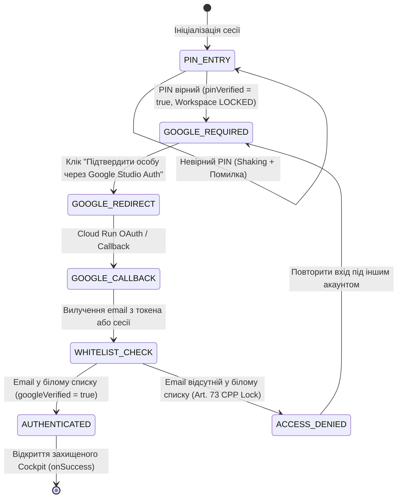

# СПЕЦИФІКАЦІЯ ДЛЯ GOOGLE AI STUDIO: РЕДИЗАЙН AUTHGATE ТА ДВОКОНТУРНА GOOGLE-АВТОРИЗАЦІЯ (TWO-TIER ZERO-TRUST)

**Проєкт:** B-SDD Legal Advocate Cockpit (`b-sdd-legal-ui`)  
**Судове досьє:** PE24.014624-SBA (Ministère public du Canton de Vaud)  
**Правовий стандарт:** Art. 73 CPP (Secret de l'instruction), Art. 13 LLCA, ISO/IEC 27037  
**Архітектурний стандарт:** B-SDD Methodology v1.2 & Invariants L-01 – L-05  
**Google Cloud Run Auth Endpoint:**  
`https://ais-dev-e2sihlyjbjzxc5lxx4nkc2-147404199355.europe-west3.run.app`

---

## 1. АРХІТЕКТУРНИЙ КОНТЕКСТ ТА КРИТИЧНИЙ ДЕФЕКТ (CRITICAL FLAW ANALYSIS)

### 1.1. Суть виявленого дефекту
Поточна реалізація `b-sdd-legal-ui/src/components/AuthGate.tsx` містить критичний дефект логіки безпеки:
1. **Передчасний допуск (Premature Workspace Exposure):** Введення локального PIN-коду термінала (`0523`) або натискання кнопки «Прямий вхід» (`handleEmergencyAdminLogin`) одразу створює сесію супер-адміністратора та надає повний доступ до робочого простору, обходячи зовнішню Google-автентифікацію.
2. **Мобільний баг геометрії (Viewport Cutoff):** Використання фіксованих та жорстких висот `min-h-screen` разом із великими статичними паддінгами на смартфонах (<640px) зсуває кнопки цифрового вводу, юридичний дисклеймер та кнопку підтвердження під системні шторки або навігаційні панелі браузерів (Safari iOS, Chrome Mobile).

### 1.2. Нормативна база захисту
Згідно зі **ст. 73 CPP Suisse** (Таємниця кримінального слідства) та **ст. 320 CP Suisse** (Порушення службової таємниці), доступ до матеріалів справи PE24.014624-SBA дозволяється **виключно верифікованим учасникам провадження**, внесеним до офіційного реєстру (Whitelist).

---

## 2. ЦІЛЬОВА АРХІТЕКТУРА ДВОКОНТУРНОЇ АВТЕНТИФІКАЦІЇ (TWO-TIER ZERO-TRUST MODEL)

Система безпеки повинна працювати як строгий кінцевий автомат (Finite State Machine):



### Двоконтурне правило допуску:
$$\text{Cockpit Access} \iff (\text{isPinValid} == \text{true}) \land (\text{isGoogleAuthenticated} == \text{true}) \land (\text{email} \in \text{Whitelist})$$

---

## 3. СТРУКТУРИ ДАНИХ ТА СТАН АВТОМАТА (TYPESCRIPT CONTRACT)

### 3.1. Етапи авторизації
```typescript
export type AuthStage = 
  | 'PIN_ENTRY'          // Контур 1: Ввід локального PIN термінала
  | 'GOOGLE_REQUIRED'    // Контур 2: PIN підтверджено, очікується Google Identity
  | 'AUTHENTICATING'     // Обробка зворотного виклику / токена
  | 'AUTHENTICATED'      // Обидва фактори підтверджено, доступ відкрито
  | 'ACCESS_DENIED';     // Відмова: Google акаунт не у Whitelist (ст. 73 CPP)

export interface AuthGateState {
  stage: AuthStage;
  isPinValid: boolean;
  isGoogleAuthenticated: boolean;
  authenticatedEmail: string | null;
  authError: string | null;
  sessionToken?: string | null;
}
```

### 3.2. Авторизований білий список (Hardened Whitelist)
Офіційний реєстр допуску досьє PE24.014624-SBA:
- `ar***@gmail.com` — Арсен Коваленко (Потерпіла сторона, цивільний позивач, ст. 115, 118, 122 CPP);
- `tu***@gmail.com` — Володимир Анатолійович Коваленко (Головний адміністратор та суверенний володар ключа);
- `vo***@gmail.com` — Інженер безпеки та архітектор B-SDD Cockpit;
- Динамічні довірені особи та адвокати, зареєстровані супер-адміністратором у `SettingsModal` (`b_sdd_authorized_google_users_v1`).

---

## 4. ІНЖЕНЕРНЕ ТЗ ДЛЯ КОМПОНЕНТА `AuthGate.tsx`

### 4.1. Мобільна адаптація та геометрія в'юпорту (Mobile-First CSS)
1. **Кореневий контейнер:**
   ```tsx
   <div className="min-h-[100dvh] max-h-[100dvh] w-full flex flex-col justify-between overflow-y-auto p-3 sm:p-6 bg-[#070B14] select-none text-slate-100 font-sans relative pb-[env(safe-area-inset-bottom,16px)]">
   ```
2. **Динамічний PIN-пад:**
   - Кнопки цифр: `h-11 sm:h-12 w-full rounded-xl bg-slate-800/60 hover:bg-slate-700/80 active:bg-blue-600/40 text-white font-mono text-base font-semibold border border-slate-700/50 touch-manipulation transition-all`.
   - Заборонено фіксовані висоти `h-screen` або `h-[90vh]`, які викликають переповнення.
   - Усі інтерактивні елементи мають клас `touch-manipulation` для усунення затримки 300мс на мобільних пристроях.

### 4.2. Контур 1: Локальний захисний бар'єр (PIN Gate)
- Поле вводу PIN-коду з маскуванням символів (`••••`).
- Перевірка значення проти `expectedPassword` (за замовчуванням `0523`).
- **КРИТИЧНО:** При успішному введенні PIN стан переводиться у:
  ```typescript
  setAuthState(prev => ({
    ...prev,
    isPinValid: true,
    stage: 'GOOGLE_REQUIRED',
    authError: null
  }));
  sessionStorage.setItem('b_sdd_pin_stage_unlocked', 'true');
  ```
- **СУВОРО ЗАБОРОНЕНО** викликати `onUserAuthenticated` або знімати блокування робочого простору на цьому етапі!

### 4.3. Контур 2: Google Identity Gate через Cloud Run
Після проходження Контуру 1 інтерфейс рендерить картку суверенного доступу:
- **Індикатор успіху Контуру 1:**
  `[✓ PIN ВЕРИФІКОВАНО · ТЕРМІНАЛ АКТИВОВАНО]`
- **Правовий дисклеймер:**
  «Ministère public du canton de Vaud · Справа PE24.014624-SBA. Для дешифрування доказів та доступу до матеріалів необхідна ідентифікація особи через Google Studio Auth».
- **Кнопка переходу на авторизацію:**
  ```tsx
  <a
    href={`https://ais-dev-e2sihlyjbjzxc5lxx4nkc2-147404199355.europe-west3.run.app?redirect_uri=${encodeURIComponent(window.location.origin + window.location.pathname)}&case_id=PE24.014624-SBA`}
    className="w-full py-3.5 px-4 bg-gradient-to-r from-blue-600 via-indigo-600 to-blue-500 hover:from-blue-500 hover:to-indigo-500 text-white font-bold rounded-xl shadow-lg shadow-blue-900/40 flex items-center justify-center gap-3 transition-all cursor-pointer text-sm"
  >
    <GoogleIcon className="w-5 h-5" />
    <span>Підтвердити особу через Google Studio Auth</span>
  </a>
  ```

### 4.4. Обробка повернення (Callback & Whitelist Engine)
Компонент під час завантаження (`useEffect`) сканує URL-параметри браузера:
```typescript
useEffect(() => {
  const urlParams = new URLSearchParams(window.location.search);
  const emailParam = urlParams.get('user_email') || urlParams.get('email');
  const tokenParam = urlParams.get('auth_token') || urlParams.get('token');

  if (emailParam) {
    handleVerifyGoogleIdentity(emailParam, tokenParam);
    // Очищення чутливих параметрів з URL без перезавантаження
    window.history.replaceState({}, document.title, window.location.pathname);
  }
}, []);
```

**Алгоритм верифікації (`handleVerifyGoogleIdentity`):**
1. Приведення email до нижнього регістру.
2. Перевірка наявності в активному списку Whitelist:
   ```typescript
   const isWhitelisted = ALLOWED_WHITELIST.includes(normalizedEmail) ||
     loadAuthorizedUsers().some(u => u.email.toLowerCase() === normalizedEmail && u.isActive);
   ```
3. **Якщо `isWhitelisted === false`:**
   - Стан переходить у `'ACCESS_DENIED'`.
   - Виводиться червоний судовий банер:
     > **ACCÈS NON AUTORISÉ (Art. 73 CPP / Art. 320 CP)**  
     > Електронну адресу `[email]` не внесено до реєстру уповноважених осіб у справі PE24.014624-SBA. Доступ заблоковано.
   - Заборонено надавати доступ або зберігати сесію!
4. **Якщо `isWhitelisted === true`:**
   - Знаходження або створення профілю `AuthorizedUser`.
   - Створення сесії:
     ```typescript
     const session: AuthSession = {
       user,
       authMethod: 'google_cloud_run',
       timestamp: Date.now(),
       token: tokenParam
     };
     setAuthSession(session, true);
     localStorage.setItem('b_sdd_legal_auth_state', JSON.stringify({
       isPinValid: true,
       isGoogleAuthenticated: true,
       email: normalizedEmail,
       timestamp: Date.now()
     }));
     ```
   - Виклик `onUserAuthenticated(user)` та зняття блокування (`onLockedStateChange(false)`).

### 4.5. Ліквідація бекдорів
- **ПОВНІСТЮ ВИДАЛИТИ** функцію `handleEmergencyAdminLogin` та кнопку «Прямий вхід» (`stage2_btn_direct_pin`). Вхід без Google-ідентифікації у судову систему є неприпустимим.

---

## 5. ГРАФОВИЙ ЗРІЗ ЗВ'ЯЗКІВ (GITNEXUS CALL TREE & BLAST RADIUS)

За даними рушія **GitNexus (KùzuDB AST Graph)**:
- **Upstream Caller:** `b-sdd-legal-ui/src/App.tsx:App` (CALLS `AuthGate`, `confidence: 0.85`).
- **Downstream Callees:**
  - `b-sdd-legal-ui/src/lib/authManager.ts:getCurrentAuthSession`
  - `b-sdd-legal-ui/src/lib/authManager.ts:setAuthSession`
  - `b-sdd-legal-ui/src/lib/authManager.ts:clearAuthSession`
  - `b-sdd-legal-ui/src/lib/authManager.ts:verifyEmailAccess`
  - `b-sdd-legal-ui/src/lib/authManager.ts:saveAuthorizedUsers`
  - `b-sdd-legal-ui/src/components/LegalStrategyModal.tsx`
- **Процеси в зоні впливу:**
  - `proc_31_app`: Ініціалізація та монтування робочого простору.
  - `proc_41_authgate`: Тайм-аут блокування та очищення сесії (`clearAuthSession`).
  - `proc_0_authgate`: Синхронізація сесії з білим списком.
- **Оцінка ризику зміни:** `LOW` — зміни повністю інкапсульовані всередині компонента `AuthGate.tsx` та не зачіпають ядро моделювання фактів (`src/legal/`).

---

## 6. ЗБЕРЕЖЕННЯ НЕПОРУШНИХ ІНВАРІАНТІВ B-SDD

1. **Invariant L-01 (WORM Bitemporality):** Збереження сесії та журналу аудиту входу у `localStorage` під ключем `b_sdd_legal_auth_state` без перезапису історії сесій.
2. **Invariant L-02 (Pure Stdlib Core):** Не торкатися модулів `src/legal/`; бекенд залишається на 100% чистій стандартній бібліотеці Python.
3. **Invariant L-03 (Bona Fide Shield):** Захист Адріано МІЛЛІ (ст. 933 CC) залишається абсолютним у всіх представленнях стратегії.
4. **Invariant L-04 (Adult Victim Protection):** Потерпілий Арсен КОВАЛЕНКО (05.11.1999) має найвищий пріоритет доступу як цивільний позивач (ст. 115, 118 CPP). Жодних відновлень ст. 219 CP.
5. **Invariant L-05 (Cryptographic Seal):** Усі передані параметри та сесійні токени верифікуються за стандартом ISO/IEC 27037.

---

## 7. ДИЗАЙН-СИСТЕМА ASTRYX SWISS DARK

- **Фонові тони:** `#060A13` (кореневий), `#0B1120` (картки шлюзу), `#070B14` (вкладені панелі).
- **Бордери:** `#1E293B` (slate-800) та `#3B82F6/40` (blue-500 акцент).
- **Акценти:** Золотий контур `#F59E0B` (Art. 73 CPP / Таємниця слідства), Смарагдовий статус `#10B981` (PIN/Google Verified), Сапфіровий `#2563EB` (Основні кнопки дій).
- **Типографіка:**
  - Шрифт інтерфейсу: Inter / SF Pro System Sans.
  - Цифровий моно-шрифт: JetBrains Mono для PIN-вводу, токенів, хешів та номеру справи `PE24.014624-SBA`.
- **Локалізація:** Повна підтримка 5 мов: UK (Українська), FR (Французька — офіційна мова судочинства Во), DE (Німецька), IT (Італійська), EN (Англійська).

---
**Специфікація готова до виконання у Google AI Studio.**
